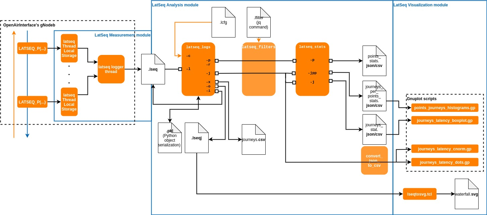
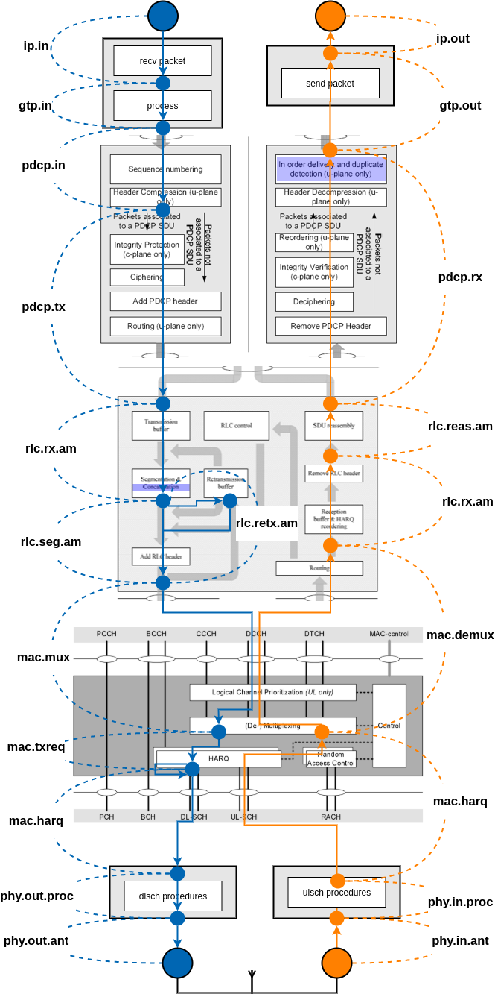
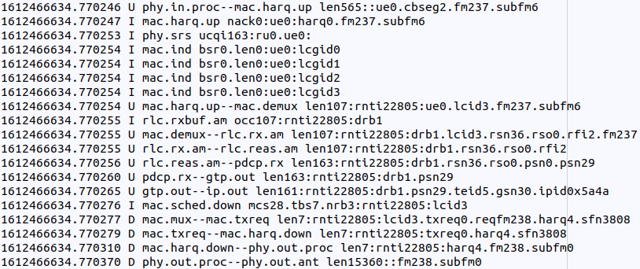
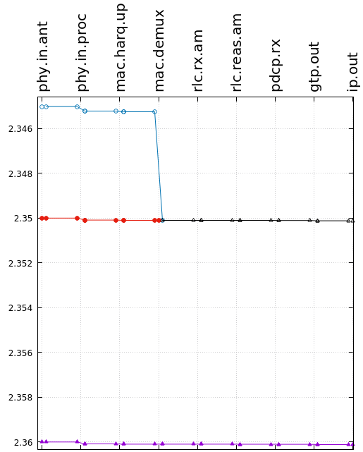
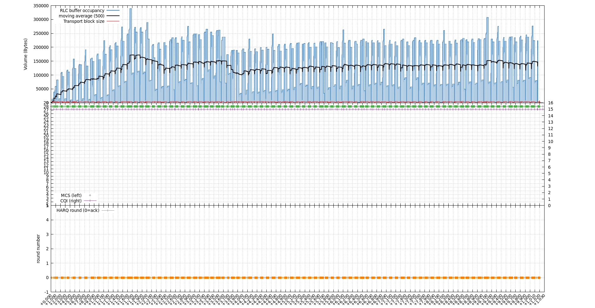
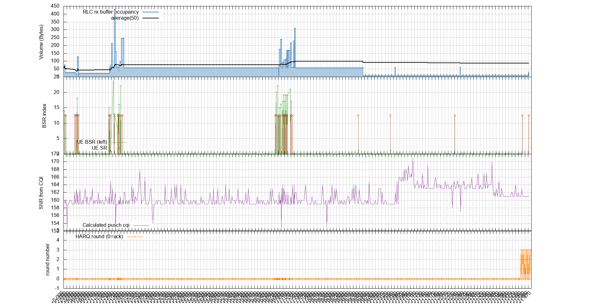

</img>

# LATency SEQuence analysis tool
Copyright &copy; 2020, Orange Labs

[](https://opensource.org/licenses/BSD-3-Clause)


*Author : F. Ronteix--Jacquet, flavien.ronteixjacquet@orange.com, Orange Labs Networks, Lannion (France)*

A tool for internal latency analysis in the OpenAirInterface Base Station.
Please find more details on the rationales behind this tool on the conference article "**Latseq: A low-Impact Internal Latency Measurement tool for OpenAirInterface**" (IEEE WCNC'21 [slides](docs/pres_latseq_wcnc.pdf))

***Abstract***
```
Amongst the appealing features of 5G, ultra low
latency is perhaps the most attractive one, as it unleashes a wealth
of disruptive services. However, meeting such a challenging goal
requires a thorough understanding of latency in the 5G prevailing
bottleneck, that is, the Base Station.
For this purpose, we propose LatSeq, an open-source tool for
fine-grained analysis of latency inside a software Base Station
(BS), and implement it on the OpenAirInterface platform. LatSeq
tackles each packet’s sequence of successive delays across the
layers of a Base Station, which reveals enlightening causal links.
This paper discusses LatSeq’s design choices and evaluates
its fitness for purpose in a first baseline usage scenario. We
demonstrate the low impact of LatSeq on the observed system,
and the relevance of statistics based on individual packet tracing
inside the base station.
```

***bibtex citation***
```
@inproceedings{Ront2103:LatSeq,
    title = {{LatSeq:} A {Low-Impact} Internal Latency Measurement Tool for {OpenAirInterface}},
    author = {Flavien Ronteix–Jacquet and Xavier Lagrange and Isabelle Hamchaoui and Alexandre Ferrieux and Stephane Tuffin},
    booktitle = {2021 IEEE Wireless Communications and Networking Conference (WCNC) (IEEE WCNC 2021)},
    keywords = {Latency; Cellular Network; Measurements; Open Source; OpenAirInterface},
	address = {Nanjing, China},
	days = 28,
	month = mar,
	year = 2021
}

```

## Repository folders

- cfg : config files
- data : data samples produced by LatSeq
- docs : general documentation
- examples : use examples
- figures : graphics and figures
- src : C source code of the tool extension (measurement part)
- test : test programs
- tools : tools to process lseq files (analysis part)

## Installation

- Put LatSeq extension source code in OAI code (https://gitlab.eurecom.fr/oai/openairinterface5g). We recommend to put it in the path *common/utils/LATSEQ*.
- In cmake_targets/CMakeLists.txt add `add_boolean_option(LATSEQ True "Active Latency Sequence tools")` and to `set(UTIL_SRC...` statement : `${OPENAIR_DIR}/common/utils/LATSEQ/latseq.c`
- Put *test/* into *targets/TEST/LATSEQ/*
- Verify installation of LatSeq with `make` in *targets/TEST/LATSEQ*

## Usage



**Write the code**

0) Put `init_latseq(appname)` and `close_latseq()` at the start and the end of Base Station (BS) main thread function.
1) Add a new LatSeq measure point in the BS source code with
```c
#include "common/utils/LATSEQ/latseq.h"
...
#if LATSEQ
    LATSEQ_P("D pdcp--rlc", "pdcp%d.rlc%d", 0, 1);  
#endif
```
where first argument is the `observed segment` (type D for Downlink, U for Uplink or I for Information), the second argument is a string of `data\_identifiers` followed by the `data identifiers value`.

**A proposal to put LatSeq points inside OAI LTE stack**



**Compile the code**

1) Compile OAI code with cmake option `LATSEQ` at True
2) Run experiment for Uplink and Downlink
3) Convert timestamps of the traces file from `/tmp/appname.date.lseq` with *rdtsctots.py* tool
3) Process lseq traces to yield data do statistics with LatSeq scripts

More to read in docs/Latseq.pdf

## LatSeq measurement module

Latseq is designed to be the more independant as possible : Means that it does not use oai LOG system (not register by logInit()) and the flag "LATSEQ" disable all lines related to latseq in the code (using #ifdef).

latseq_t, global structure for latseq embodied the latseq logging info. log_buffer is a circular buffer with 2 head index, i_write_head and i_read_head. this buffer of latseq_element_t is designed to bo mutex-less.

`LATSEQ_P` macro calls `log_measure()`. The idea is to have a low-footprint at logging explains why log_measure() should do a minimal amount of operations.

`latseq_log_to_file()` is the function run in the logger thread. It writes log_elements in the log file.

LATSEQ_P with direction of D (Downlink) or U (Uplink) observed the passage of a data.
LATSEQ_P with direction of I (Information) observed a scalar property at a point of code. e.g. buffer occupancy.

**We assume that**:
- All the point and latseq module run on the same machine (to don't have to synchronize clock of different machines)
- Clock give by asm rdtsc is same for all the CPU cores (`constant_tsc` enabled)


## LatSeq Analysis module
- **latseq_checker** : verify constitency of Latseq points before compiling
- **rdtsctots** : convert rdtsc value to unix timestamp value
- **latseq_logs** : convert lseq log file into useful json file for statistics and visualization
- **latseq_filter** : filter output of latseq_logs
- (latseq_stats : perform statistic)

### latseq_checker
Checker to verify that points LATSEQ_P points are consistent.
Verify the number of argument, the emptiness, format...

ex. `./latseq_checker.sh /home/oai/`

### rdtsctots
convert rdtsc value to unix timestamp value

ex. `./rdtsctots.py trace_raw.lseq > trace.lseq`

### latseq_logs

**THIS SCRIPT SHOULD BE ADAPTED FOR THE NEW LATSEQ FINGERPRINT DATA IDENTIFIERS OPTIONS : DOES NOT USE THIS SCRIPT WITH THE LAST VERSION OF LATSEQ MEASUREMENT MODULE**

Proceeds LatSeq logs.
By default, builds the latseq_log object.
- Reads lseq file given in raw_input
- Cleans raw_input to inputs.
- Builds points structure and paths possible.
- Saves object related to the *.lseq files to a *.plk (pickle)

**Arguments**:
- "-h" : help
- "-C" : cleans pickle file associated to the log file and rebuild
- "-l" : required lseq file of fingerprints
- "-i" : request cleaned input measurements in the case of command line script
- "-r" returns the paths present in the log file as json.

```json
{
    "D": [
        ["ip", "pdcp.in",...],
        ...
    ],
    "U": ...
}
``̀

- "-p" returns points structure as json.
Becareful, if journeys has not been rebuilt, then you do not have "duration" attibute which is used for statistics.

```json
{
    "layer1.point": {
        "next": [layer2.point2,...],
        "count": 5,
        "dir": [0],
        "duration": {
            "journeys uid": 0.0115,
            ...
        }
    }
}
{
    ...
}
```

- "-j" returns journeys structure as json.
	- Rebuilds journeys with rebuild_packets_journey method
	- Builds out_journeys

```json
{
    "uid": 52,
    "dir": 0,
    "glob": {
        "rnti": "54614",...
    },
    "set": [[1542, 1592409314.253678, "rlc.rx.am--pdcp.rx"],[...],...],  # set of pointer to input entry
    "set_ids": {
        "drb": "1",...
    },
    "path": 0,  # path according to direction and paths obtainable by -p
    "completed": true,
    "ts_in": 123.456,
    "ts_out": 789.012
}
{
    ...
}
```

- "-m" returns metadata of information as list
```txt
20200423_143226.191801  rlc.am.txbuf    occ1:drb1
20200423_143226.191802  rlc.am.txbuf    occ2:drb1
...
20200423_143226.192000  rlc.um.txbuf    occ15:drb2
```

- "-o" returns a latseq journey file line by line. redirects output to a file to have a *.lseqj for waterfall generation
```txt
#funcId ip pdcp.in pdcp.tx rlc.tx.um rlc.seg.um mac.mux mac.txreq phy.out.proc phy.in.proc mac.demux rlc.rx.um rlc.unseg.um pdcp.rx 
20200423_143226.191801 D (len64)        ip--pdcp.in.gtp uid0.rnti54614.drb1.gsn12
20200423_143226.191802 D (len64)        pdcp.in--pdcp.tx        uid0.rnti54614.drb1.gsn12.psn10
20200423_143226.191803 D (len66)        pdcp.tx--rlc.tx.um      uid0.rnti54614.drb1.psn10.lcid3.rsdu0
```

Requested json are printed in stdout line by line
Errors, Warnings, Informations are printed in stderr

Examples of usage:
```bash
python3 tools/latseq_logs.py -l data/latseq.simple.lseq 2>/dev/null
python3 tools/latseq_logs.py -j -l data/latseq.simple.lseq 2>/dev/null
python3 tools/latseq_logs.py -p -l data/latseq.simple.lseq 2>/dev/null
python3 tools/latseq_logs.py -o -l data/latseq.simple.lseq > simple.lseqj 2>/dev/null
```

### latseq_filter
Applies a filter to a json stream.
It uses jq filters.
Help website to design jq filter : https://jqplay.org/

Takes a file with a filter or a filter as string in argument.

Example of usage:
```
./tools/latseq_filter.sh journeys_downlinks_gsn.lfilter
cat journeys_downlinks_gsn.lfilter
> select(.["dir"] == 0 and .["set_ids"]["gsn"] == "18")
```

### latseq_stats
Performs statistics from json. Report json or print in stdout.

By default, reads on stdin. "-l" *.lseq will try to open a *.json associated.
By default, returns a json report on stdout.

Arguments:
- "-f" enables to choose format "json", "csv",...
- "-P" prints statistics formated by the latseq_stats module.
- "-sj" returns statistics on journeys

```json
{
    "D": {
        "size": 34,
        "min": 0.19598,
        "max": 1.187086,
        "mean": 0.788976,
        "stdev": 0.153623,
        "quantiles": [0.694859, 0.699043, 0.834942, 0.838041, 0.955701]
}
```

- "-sjpp" returns the shares of delay introduced by each point for each journeys by path.

```json
{
  "U02": {  # Uplinks, path 0, point 2
    "size": 4,
    "min": 0,
    "max": 0.7273,
    "mean": 0.36239999999999994,
    "stdev": 0.2915949673776967,
    "quantiles": [
      0.025005000000000003,
      0.125025,
      0.36114999999999997,
      0.598525,
      0.7015449999999999
    ]
  }
}
```

- "-sp" returns statistics on points

```json
{
    "pdcp.rx": {
        "dir": "U",
        "size": 4,
        "min": 0.01,
        "max": 0.02,
        "mean": 0.015,
        "stdev": 0.005,
        "quantiles": [0.012,...]  # 5%, 25%, 50%, 75%, 95%
    },
    ...
}
```

- "-djd" returns data journeys' duration

```json
{
    "00": {  # first decimal indicates uplink/downlink followed by the journey unique id
        "ts": 1587645146.191801,
        "durations": 0.19598  # in ms
    },
    ...
}
```

Example of usage of the full toolchain for LatSeq Analysis Module

```bash
python3 tools/latseq_logs.py -l data/latseq.simple.lseq -j 2>/dev/null | ./tools/latseq_filter.sh cfg/journeys_downlinks_gsn.lfilt | python3 tools/latseq_stats.py -sj --print
```

## TEST_LATSEQ
in targets/TEST/LATSEQ test_latseq test different part of latseq module
- "h" : help menu
- "i" : test init and close latseq
- "a" : test init, capture 2 fingerprints and close
- "t" : same test as "a" but with 2 concurrent threads
- "m" : test measurement time to capture 1000000 fingerprints
- "n" : test measurement time to capture 1000 fingerprints with 1,2,3,5,10 data identifiers
- "w" : test writer speed for a simplified data collector

## Screenshots

**LatSeq measurement module output file**:


**Waterfall in gnuplot**:


**Downlink info metrics**:


**Uplink info metrics**:



## TODO
- [ ] adapt journey rebuild script to the new data_idenfiters options.
- [ ] list of requirements on data\_identifiers to enable rebuild journeys
- [ ] optimize algorithm to rebuild paths
